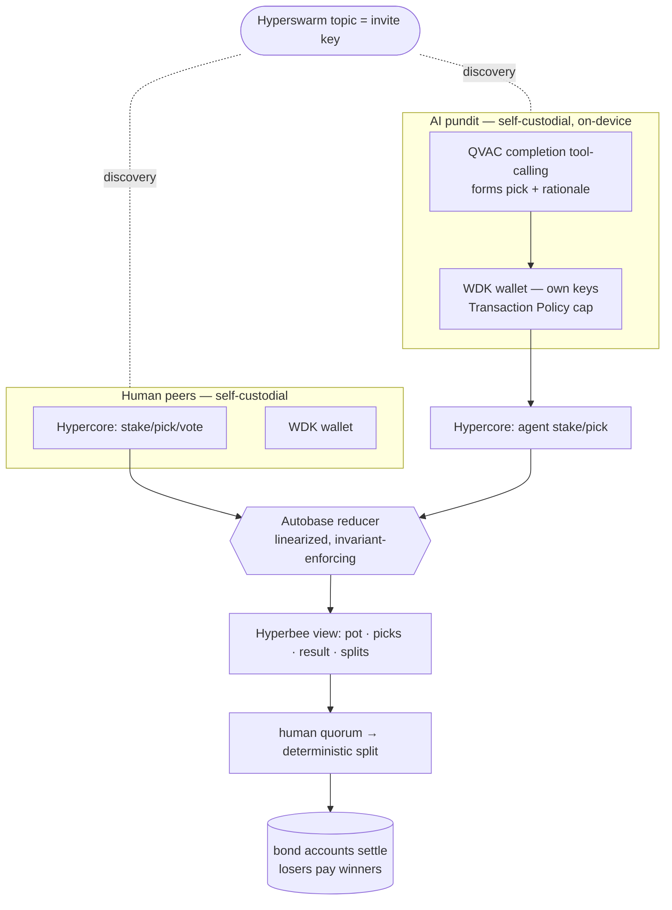

<div align="center">
  
  <h1>The Treble ⚽🤖</h1>
  <p><em>A trustless prediction pot where an on-device AI stakes its own money against you.</em></p>
  <!-- animated SVG (SMIL) — animates in the rendered README; PNG fallback: docs/readme-hero.png -->
  

  <br/>

  <a href="https://github.com/edycutjong/treble/actions/workflows/ci.yml"></a>
  <br/><br/>
  <a href="https://youtu.be/wVB0fkf1BLU"></a>
  <a href="landing/index.html"></a>
  <a href="https://edycutjong.github.io/treble/"></a>
  <a href="https://dorahacks.io/hackathon/tether-developers-cup"></a>

  <br/>

  
  
  
  
  
  

</div>

---

## 📸 See it in action

```console
$ npm run demo

⚽ THE TREBLE — humans vs. the machine, no server, no house, no cloud

🏆 pot opened  "Kitchen Table Clásico" — Brazil vs Argentina, buy-in 20 USD₮
👤 Ana  staked 20 USD₮ tx sim0xf6a9cffaea1a9…  pick 3-1 (keys on their own device)
👤 Bo   staked 20 USD₮ tx sim0x99a5a43bb4fbc…  pick 0-0 (keys on their own device)
👤 Cai  staked 20 USD₮ tx sim0x1e9519b925278…  pick 1-2 (keys on their own device)

🤖 THE GAFFER (its OWN keypair + WDK wallet, Transaction Policy cap 20 USD₮)
   policy pre-flight: ALLOW (allow-bounded-usdt-stake)
   🧠 [brain: heuristic] "Backing 1-1 the draw — argentina unbeaten in 14
      competitive matches" confidence 60%
   💰 autonomously staked 20 USD₮ tx sim0xd2be4b99cd834… from its own wallet

🔒 KICKOFF — pot locked on the shared append-only ledger
🚫 Bo tried to change his pick after kickoff → REJECTED by every peer
🚫 the machine tried to vote on the result → REJECTED (agent-has-no-result-authority)
✅ result finalized by 2/3 staked humans (quorum)

💸 settlement — winners release their own bond, losers pay winners
Σ CHECK  paid 80 USD₮ == staked 80 USD₮  ✓ zero-sum, no house cut
CONVERGENCE  4 peers, one shared state hash  ✓ byte-identical everywhere

🏁 THE MACHINE TAKES THE POT  Humans 0 – 1 AI Pundit
```

> **Stake → tamper-evident pick lock → human consensus → deterministic split.**
> Four real Autobase peers, real WDK Transaction Policies, real receipts — in ~20 seconds, fully offline.

---

## 💡 The problem & the twist

Every friend group runs a tournament pot, and every pot has the same two flaws: **someone has to hold the money**, and **someone has to be trusted not to "misremember" their pick**. Meanwhile, everyone argues about whether an AI could out-predict the group — but "AI plays too" normally means a cloud API with someone else's wallet.

**The Treble** rebuilds the pot with no treasurer and no server — and gives the AI a real seat at the table:

- 🪙 **Self-custodial stakes** — every player (human *and* machine) bonds USD₮ from a wallet only they control. No custodian anywhere.
- 🧠 **An on-device opponent** — the AI pundit reasons about the match locally via QVAC, streams a one-line rationale, and **stakes its own money with its own keys**.
- 🔒 **Tamper-evident picks** — signed, append-only Hypercore logs, linearized by Autobase, frozen at kickoff. A post-kickoff edit is rejected by every peer.
- ⚖️ **The machine can't cheat** — it has *strictly less* power than humans: no result votes, no locking, no inviting accomplices. Enforced by the consensus reducer, tested over the wire.
- 💸 **Deterministic settlement** — a quorum of staked humans confirms the score; `Σ payouts == Σ stakes` to the micro-USD₮, dust assigned deterministically.

## 🏗️ Architecture & stack

| Layer | Technology | Why it is load-bearing |
|---|---|---|
| **P2P state** | Pear: Corestore → Hypercore → **Autobase** → Hyperbee, Hyperswarm rooms, Protomux seat-requests | The multi-writer pot with no server; the AI is *just another writer* |
| **Money** | **@tetherto/wdk 1.0.0-beta.12** + a custom `WalletManager` (sim engine) / `wdk-wallet-solana` (devnet) | Self-custody for every participant; the agent's cap is WDK's **real default-deny Transaction Policy engine** |
| **Mind** | **@qvac/sdk 0.14.0** `completion()` tool-calling (`submit_pick`), Qwen3 1.7B on-device | The pick is a genuine on-device model decision — zero cloud calls |
| **Consensus core** | Pure deterministic reducer (`src/core/reducer.js`) | Every peer applies identical rules → byte-identical state hashes |



Full details: [ARCHITECTURE.md](docs/ARCHITECTURE.md)

## 🚀 Getting started

**Prerequisites:** Node ≥ 20. Optional: [Pear runtime](https://docs.pears.com) for the desktop UI, a local GGUF model for the QVAC brain.

```bash
npm install
npm run demo                 # the full humans-vs-machine match, offline, ~20s
```

**For judges:** `npm run demo` needs no keys, no accounts, no network. Try `--outcome humans`, `--outcome refund`, or type your own pot:

```bash
node src/cli.js create --buy-in 20 --kickoff-mins 30   # prints a treble1… invite
node src/cli.js join <invite>                          # a friend, second terminal/device
npm run agent -- <invite>                              # the AI pundit joins by itself
pear run .                                             # desktop UI (Pear runtime)
```

**The QVAC brain:** the demo/CI default is a **disclosed deterministic heuristic** (label: `[brain: heuristic]`) so everything runs without a ~1 GB model download. Run the real on-device LLM with `npm run agent -- <invite> --brain qvac` (first run downloads Qwen3 1.7B via `@qvac/sdk` — the model empirically verified to emit well-formed tool calls on-device), or point `TREBLE_QVAC_MODEL` at any local GGUF. The seat, policy cap and ledger path are identical for both brains.

**Real-chain settlement:** the wallet layer is engine-modular. `--engine solana` uses `@tetherto/wdk-wallet-solana` on devnet (install it, fund the printed address from a faucet). The default `sim` engine is a disclosed local ledger so the whole flow — including policy enforcement — is verifiable offline.

## 🧪 Testing & CI

**198 tests, 664 assertions (brittle) — 100% line, function AND branch coverage on `src`.** The only c8-ignored lines are true I/O boundaries or provably-unreachable defensive guards, each labelled with an honest reason: the live QVAC model calls, real Hyperswarm/DHT sockets, the CLI/agent process bootstrap, the optional Solana module, and the demo's own invariant self-checks (proven in the reducer/settlement suites). Count is verified, not typed (`npm run test:count`); coverage is gated at 100/100/100 (`npm run coverage`).

```bash
npm test               # unit + integration (incl. multi-peer Autobase over real replication streams)
npm run coverage       # the suite under c8 with the honesty gate (100% lines/functions on src)
npm run e2e            # the full demo × 4 scenarios (3 outcomes + policy-decline)
npm run verify:p2p     # proves no server: convergence + server-socket tripwires
npm run verify:offline # proves on-device: full agent flow with networking booby-trapped
npm run bench          # reproducible p50/p95
npm run lint           # standard
npm run check:ready    # submission readiness gate (fails on placeholders/stale claims)
```

| Layer | Tool | Status |
|---|---|---|
| Code quality | standard (ESLint) | ✅ zero warnings |
| Unit + integration | brittle — 198 tests / 664 asserts | ✅ |
| Coverage | c8 — 100% lines, functions & branches on `src` | ✅ gated (`npm run coverage`) |
| E2E | 4-peer demo × 4 scenarios (incl. policy-decline) + 2 verifiers | ✅ |
| Security (SAST) | CodeQL | ✅ workflow |
| Security (SCA + secrets) | Dependabot + npm audit + TruffleHog | ✅ workflow |
| CI/CD | 6-stage pipeline (quality → security → build → e2e → perf → gate) | ✅ |

What the tests actually pin down (depth over count): pick immutability incl. backdated timestamps, `Σ payouts == Σ stakes` with deterministic dust, agent parity (same rules) **and** agent inferiority (no votes/locks/grants — verified over real replication, including the "agent seats an accomplice bot" attack), the WDK policy engine throwing real `PolicyViolationError`s, cumulative session caps that simulations can't drain, state-hash convergence across 3–4 peers, and escrowless settlement where every winner is made exactly whole.

## 📊 Benchmarks (reproducible)

`npm run bench` — Apple M1 Max, Node 22 (your numbers will vary; the script prints its methodology and writes `bench-results.json`):

| Path | p50 | p95 |
|---|---|---|
| Consensus core — full 8-member pot lifecycle (40 ops incl. finality + split) | 0.59 ms (≈65k ops/s) | 0.75 ms |
| Append on one peer → **byte-identical state on the other** (real Autobase replication) | 5.7 ms | 7.0 ms |
| Agent seam — seat grant → policy pre-flight → pick → bonded on the ledger | 13.1 ms | 15.9 ms |

## 🛡️ Why ONLY Pear + QVAC + WDK

- **Pear**: Autobase *is* the trustless pot — the agent is just another writer; Hypercore makes picks tamper-evident; Hyperswarm makes an invite a room. Without it: a server plus a trusted timestamper.
- **WDK**: self-custodial accounts for humans *and* the machine; the agent's cap is WDK's real policy engine (`registerPolicy` → default-deny → `PolicyViolationError`). Without it: a custodian puppeting an "AI wallet".
- **QVAC**: `completion()` tool-calling makes the pick a genuine local model decision; the offline verifier proves reasoning needs no network. Without it: a cloud API — neither private nor yours.

Take any one out and The Treble is impossible, not merely harder → [SPONSOR_DEFENSE.md](docs/SPONSOR_DEFENSE.md)

## ⚠️ Honest limitations

- **Escrowless settlement**: losers *owe* winners per the deterministic plan; a dishonest peer could refuse to execute their legs. The tamper-evident debt record survives them; an on-chain escrow is the v2 path. ([AUDIT_REPORT](docs/AUDIT_REPORT.md))
- **Consensus collusion**: a colluding majority of staked humans could finalize a wrong score. Documented, not hidden.
- **Sim engine by default**: demo settlement runs on a disclosed local ledger; the WDK policy engine governing it is real. Devnet is a config swap, not a rewrite.
- **`@tetherto/wdk` is beta** (pinned to `1.0.0-beta.12`); the QVAC-brain path depends on local hardware for model speed.
- **Pending before submission**: public repo push + CI badge URL, ≤3-min demo video, devnet tx hashes for one human + one agent stake.

## 📖 Prior work & disclosure (hackathon rule #8/judging)

Built during the official window (June 28 – July 14, 2026). Same-team sibling projects **The Kitty** (trustless pot, Pear×WDK) and **PunditPay** (on-device paying pundit, QVAC×WDK) share the design lineage — The Treble is the all-three fusion, and this repository's code is written for this build. Third-party: the Holepunch stack, `@tetherto/wdk`, `@qvac/sdk` (all Apache-2.0/MIT), `brittle`, `standard`. The `tetherto/qvac-examples` repos (esp. `qvac-coffee-conversation`) informed the QVAC tool-calling shape. No cloud AI APIs anywhere.

## 📁 Project structure

```
build/
├── src/core/        reducer · ops · split · settlement · money · canonical   (the consensus core)
├── src/p2p/         TreblePot (Corestore→Autobase→Hyperbee, Hyperswarm, invites)
├── src/wallet/      WDK facade · sim WalletManager · policy caps · bond accounts
├── src/agent/       strategies · QVAC brain · disclosed heuristic · AgentSeat · runner
├── src/cli.js       demo / create / join (judge-runnable)
├── index.html+app.js  Pear desktop UI          ├── landing/   one-page explainer
├── test/            198 tests (brittle)        ├── scripts/   bench · verifiers · seed · e2e · readiness
└── docs/            architecture · submission · demo · sponsor-defense · audits · friction log · pitch deck · assets
```

## 📄 License

[Apache-2.0](LICENSE) © 2026 Edy Cu — as the Tether Developers Cup rules require, and happily.

## 🙏 Acknowledgments

Built for the **Tether Developers Cup 2026**. Thank you to the Pear, QVAC and WDK teams for shipping stacks where "no server, no custodian, no cloud" is something you can actually type `npm install` for — and to you, for reviewing this. We wanted to know if we could out-pick a machine that reasons about football; now it has its own wallet, and we genuinely don't always win.
