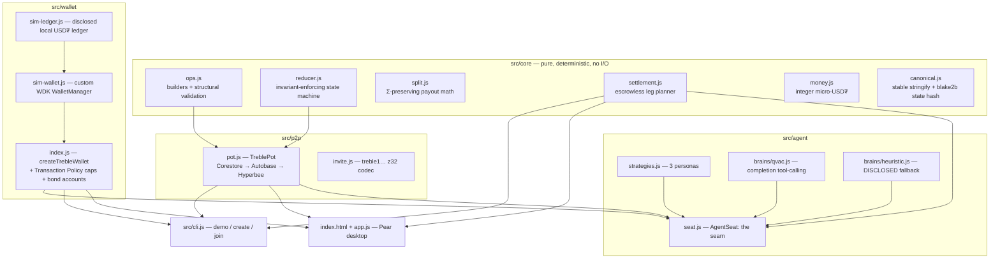

# Architecture — The Treble (build)

> Spec lineage: this implements the fused design of the sibling specs *The
> Kitty* (Pear pot + WDK settlement) and *PunditPay* (QVAC paying pundit).
> This document describes what is actually built in this repository.

## Layer map

## The consensus core (`src/core`)

Every peer feeds the same linearized ops through `reduce(state, op, { from })`
— a **pure function** that never throws on input and rejects illegal ops with
deterministic reasons. `from` is the hex key of the Hypercore writer the op
arrived on, so authority is enforced by Hypercore signatures, not claims in
the payload.

Op lifecycle: `open → add-writer → join → stake → pick → lock → vote(→ finality
→ splits) → settle`, plus display-only `note`s (the agent's rationale rides a
`pick.note`).

**Role capability matrix** (enforced in the reducer, tested over the wire):

| capability | human member | AI agent member |
|---|---|---|
| join / stake / pick | ✓ | ✓ (identical rules) |
| grant writers (`add-writer`) | ✓ | ✗ `agent-cannot-add-writers` |
| lock at kickoff | ✓ | ✗ `agent-cannot-lock` |
| vote on the result | ✓ (if staked) | ✗ `agent-has-no-result-authority` |

## P2P layer (`src/p2p/pot.js`)

- **Corestore → Autobase 7**: each participant appends to their own input
  core; the `apply` handler runs the reducer and writes `state` +
  `event/<seq>` records to a **Hyperbee** view (`valueEncoding: json`).
  Because the view is derived only from view+nodes, Autobase's undo/reapply
  reordering stays correct.
- **Security-critical wiring**: `host.addWriter()` is called **only when the
  reducer accepts** an `add-writer` op. A rejected grant (e.g. the agent
  seating an accomplice) never gains base write capability — covered by an
  explicit attack test.
- **Hyperswarm**: the pot topic is the bootstrap key's discovery key; the
  `treble1…` invite (z32 of the bootstrap key) is the membership secret.
  Connections are Noise-encrypted by Hyperswarm itself.
- **Seat requests**: a tiny Protomux channel (`treble/1/hello`) rides the same
  replication stream; a human approves → `add-writer` op → capability.

## Wallet layer (`src/wallet`)

- `createTrebleWallet({ engine, ledger, agentPolicy })` builds a real
  `new WDK(seed)` instance. Engines:
  - **`sim`** — `SimWalletManager extends WalletManager` from
    `@tetherto/wdk-wallet`, settling on a **disclosed** deterministic local
    ledger (`SimLedger`). Because it plugs into the real WDK pipeline, the
    REAL policy engine governs it.
  - **`solana`** — dynamic import of `@tetherto/wdk-wallet-solana` (devnet);
    same call sites, real chain.
- **Agent policy** (`agentPolicy: { perTxCap, sessionCap }`) registers a real
  WDK Transaction Policy: one ALLOW rule for bounded USD₮ transfers, one
  explicit DENY (so violations carry `policyId`/`ruleName`), and WDK's
  **default-deny** covers everything else (the governed agent cannot even
  `sign()` arbitrary payloads). The cumulative cap reads **executed**
  transfers from the ledger, so `simulate.*` can never drain the budget.
- **Bond accounts**: staking ring-fences the buy-in into the participant's
  own per-pot sub-account (`bondIndexFor(potKey)` → deterministic derivation
  index). Self-custody is preserved; the stake-time receipt is real.

## Settlement (`src/core/settlement.js`)

Escrowless and deterministic: winners self-release `min(stake, payout)` from
their own bond; losers' bonds pay winners' remainders, matched greedily in
ascending id order. Invariants: every winner made exactly whole, every loser
pays exactly their stake, Σ moved == pot. The **trust gap** (a peer refusing
to execute their legs) is documented in [docs/AUDIT_REPORT.md](docs/AUDIT_REPORT.md) — the
tamper-evident debt record survives refusal; on-chain escrow is the v2 path.

## The agent seam (`src/agent/seat.js`)

1. `requestAndWaitForSeat` — hello → a human grants role `agent`.
2. `join` with its wallet address.
3. **Policy pre-flight** — `account.simulate.transfer(...)` against its own
   WDK policy; a DENY makes the agent *decline the pot on the ledger*
   (bounded autonomy you can see).
4. Brain forms the pick: `brains/qvac.js` (real `completion()` +
   `submit_pick` tool on Qwen3 1.7B, `run.events` → `toolCall`) or `brains/heuristic.js`
   (deterministic, **always labeled**). Same decision boundary either way.
5. `stakeBond` (real receipt) → `stake` + `pick(note: rationale)` ops.
6. On finality: executes its settlement legs and appends `settle`.

## Concurrency notes (empirically verified)

- Ops from different writers are causally concurrent until replicated;
  Autobase linearizes deterministically. The pot's social contract is that
  peers converge long before kickoff (minutes, not milliseconds); the
  reducer stays safe either way — a pick that linearizes after the lock is
  rejected on every peer identically. See AUDIT_REPORT "pick/lock window".
- Both sides of a replication pair must `update()` for acks to flow — the
  bench and tests tick both peers.

## What runs where

| Surface | Runtime | Verified in this repo by |
|---|---|---|
| CLI demo / create / join / agent | Node ≥ 20 | `npm run e2e`, `npm test` |
| Desktop UI | Pear (pear-electron) | same modules as CLI; UI logic parses under Node |
| Tests / CI | Node 20/22/24, no optional deps | GitHub Actions 6-stage pipeline |
| QVAC brain | Node (Bare-ready per SDK) | code path + arg normalization tested; model runs on dev hardware |
